# Senzory a periferie
Aplikace vytvořená v rámci bakalářské práce na Technické univerzitě v Liberci během akademického roku 2025/26.

## Logo aplikace

  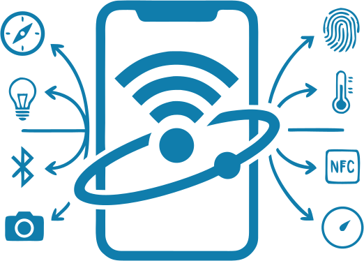

## Použitá technologie a požadavky
* Aplikace byla vyvinuta pomocí frameworku [.NET MAUI 10](https://learn.microsoft.com/cs-cz/dotnet/maui/what-is-maui?view=net-maui-10.0)
* Minimální verze Androidu: **10 (API 29)**

## Instalace
- Nejnovější verze aplikace (tedy i **APK soubor**) je k dispozici ke stažení na [GitHub Releases](https://github.com/DanielRybar/SensorsAndPeripherals/releases)
- Pro instalaci aplikace je třeba povolit instalaci z neznámých zdrojů (protože APK soubor není distribuován přes Google Play)

## Návod k použití
- Základní návod k použití vytvořený v rámci předmětu **NTI/PDO** v roce 2026 je k dispozici online [ZDE](https://danielrybar.github.io/PDO/)

## Vybrané screenshoty z aplikace
Aplikace se skládá celkem ze 17 obrazovek. Většina z nich obsahuje navíc také modální okna s popisem dané komponenty. Níže jsou uvedeny vybrané ukázky uživatelského rozhraní demonstrující světlý i tmavý motiv.

### O aplikaci
| Světlý režim | Tmavý režim |
|-------------|-------------|
| 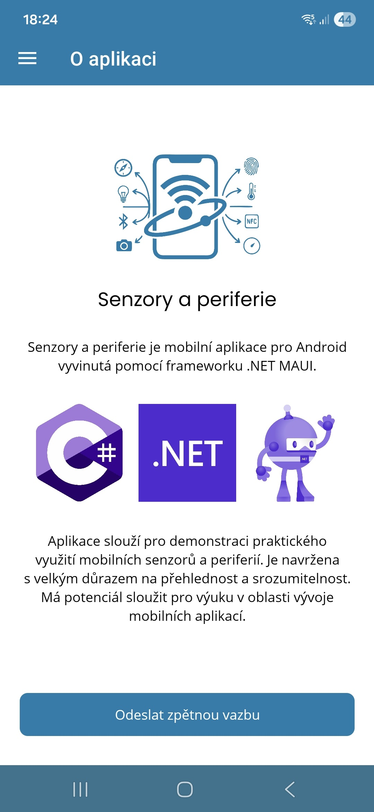 | 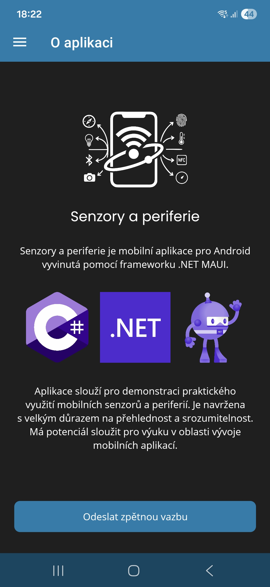 |

### Navigace aplikace (Shell)
| Světlý režim | Tmavý režim |
|-------------|-------------|
| 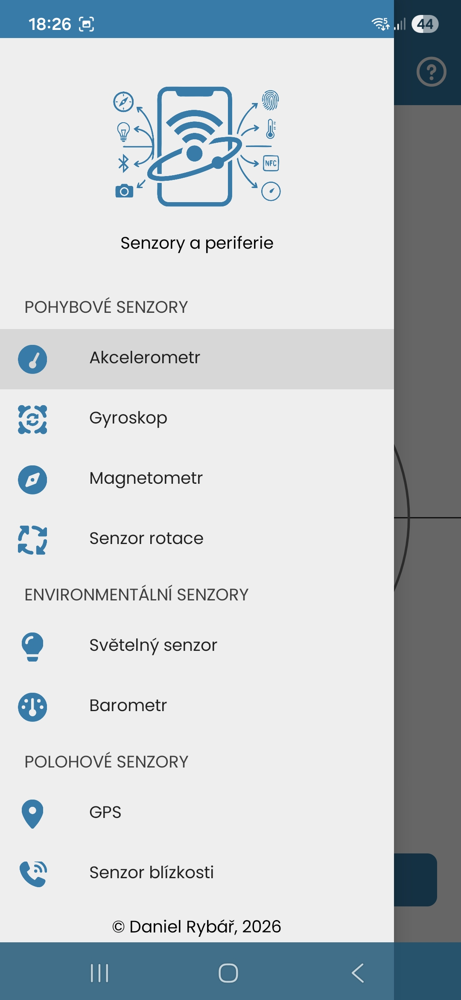 | 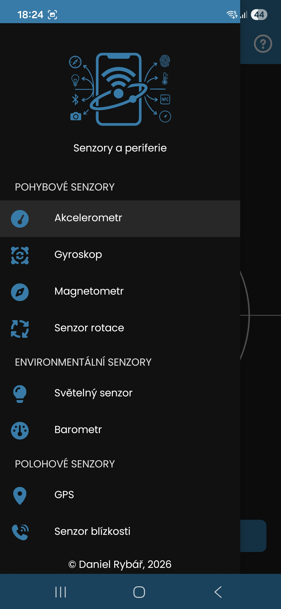 |

### Přehled dostupných senzorů
| Světlý režim | Tmavý režim |
|-------------|-------------|
| 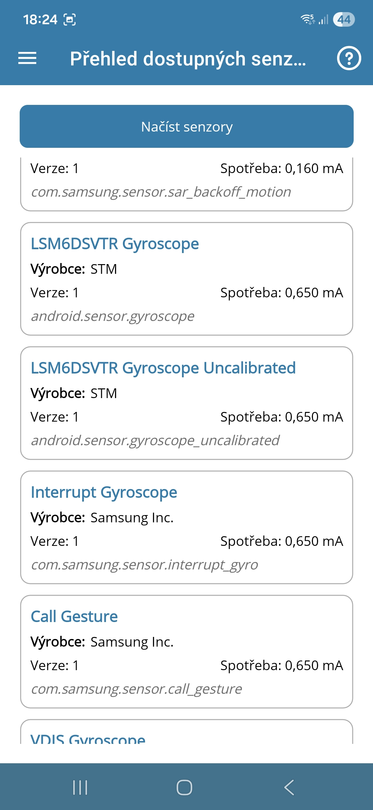 | 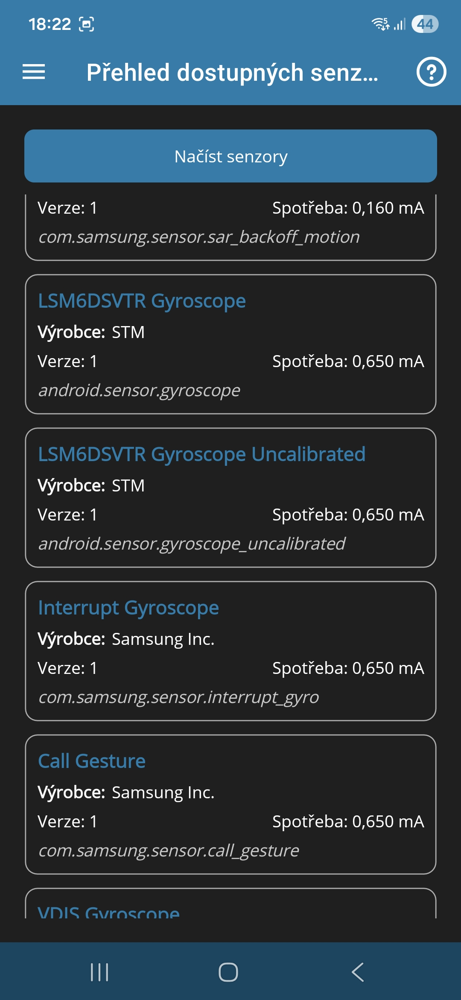 |

### Magnetometr (kompas)
| Světlý režim | Tmavý režim |
|-------------|-------------|
| 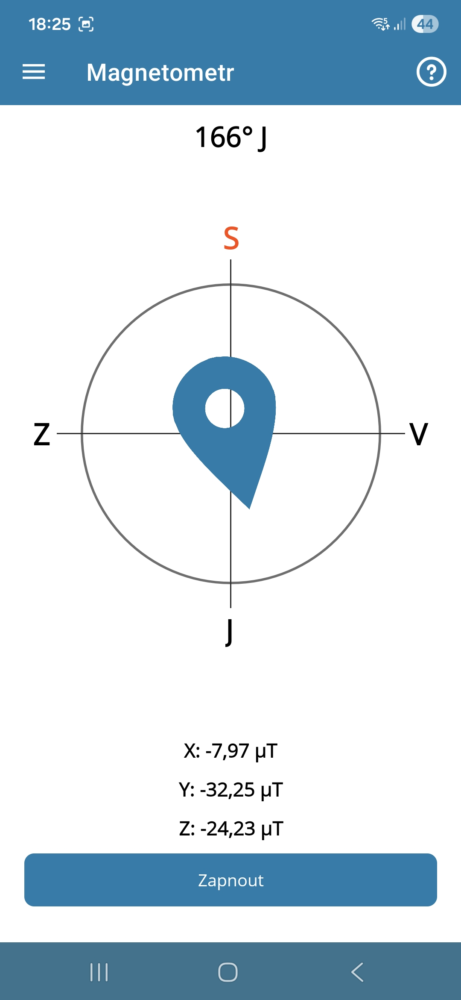 | 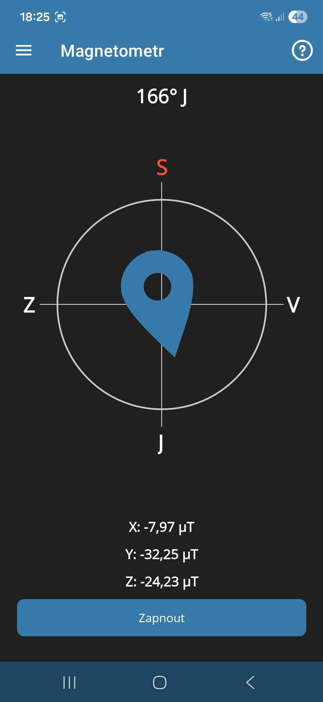 |

### Světelný senzor
| Světlý režim | Tmavý režim |
|-------------|-------------|
| 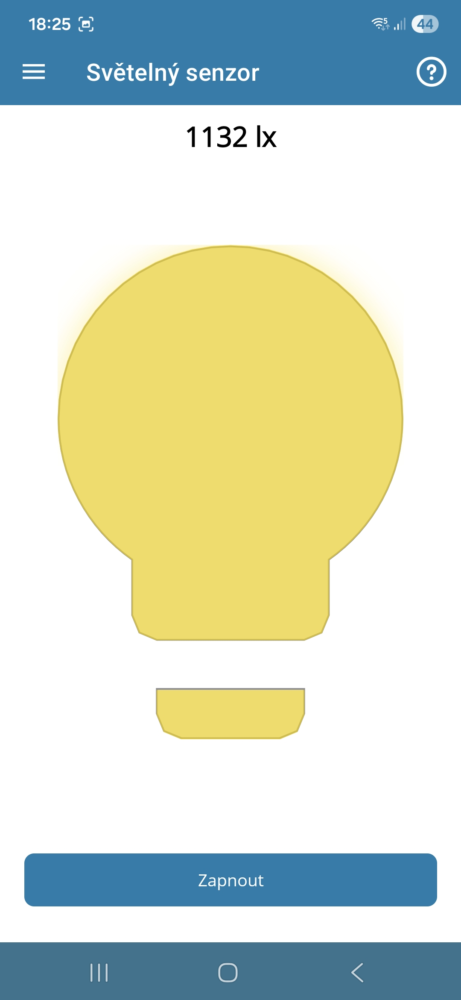 | 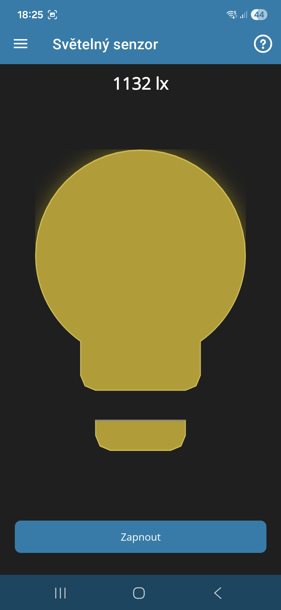 |

### Biometrika
| Světlý režim | Tmavý režim |
|-------------|-------------|
| 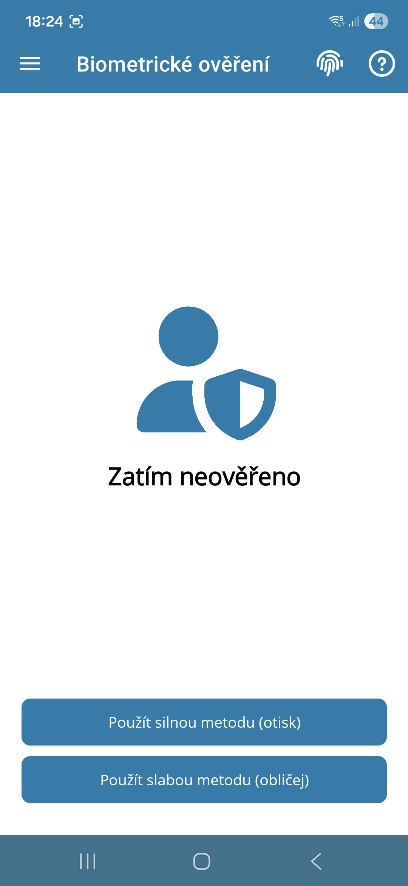 | 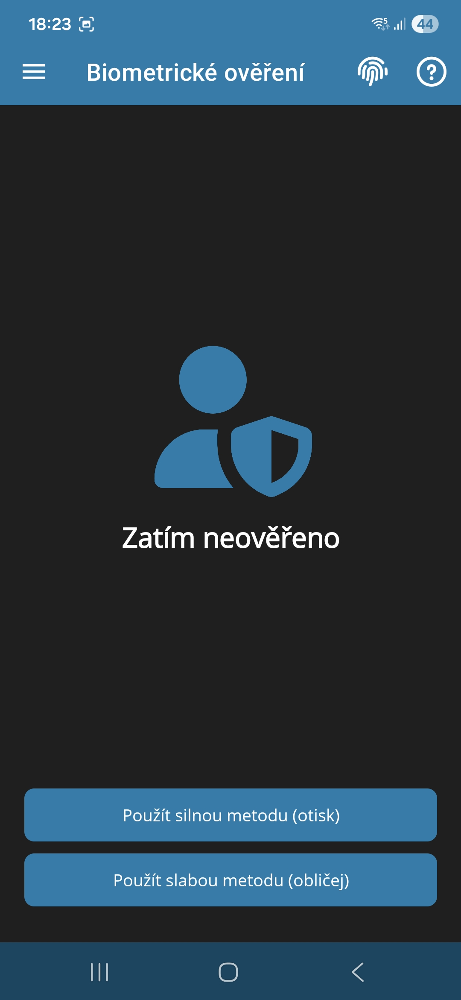 |

### Biometrika - modální stránka
| Světlý režim | Tmavý režim |
|-------------|-------------|
| 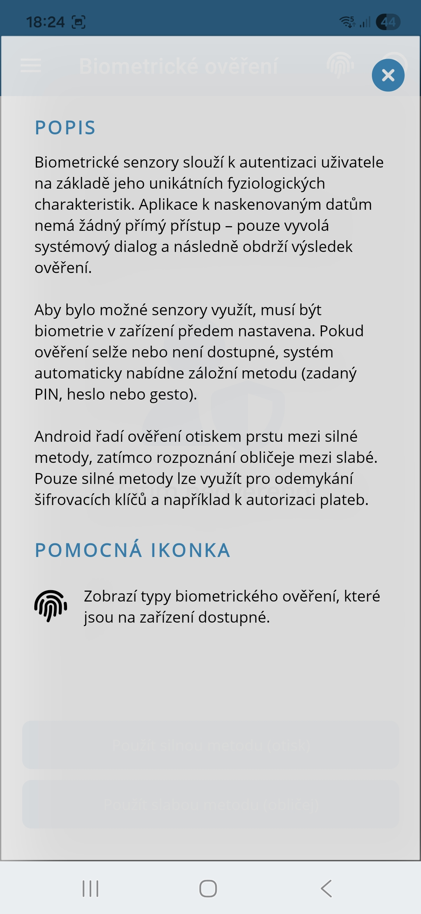 | 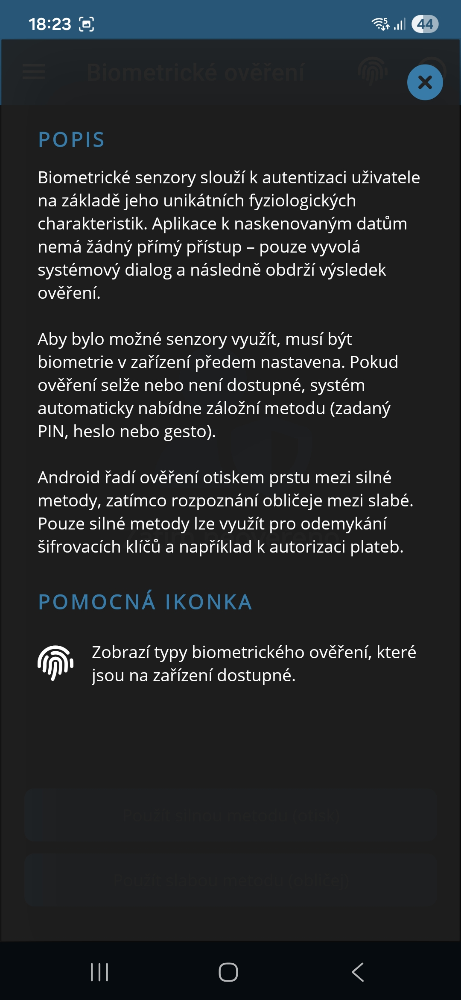 |

### NFC
| Světlý režim | Tmavý režim |
|-------------|-------------|
| 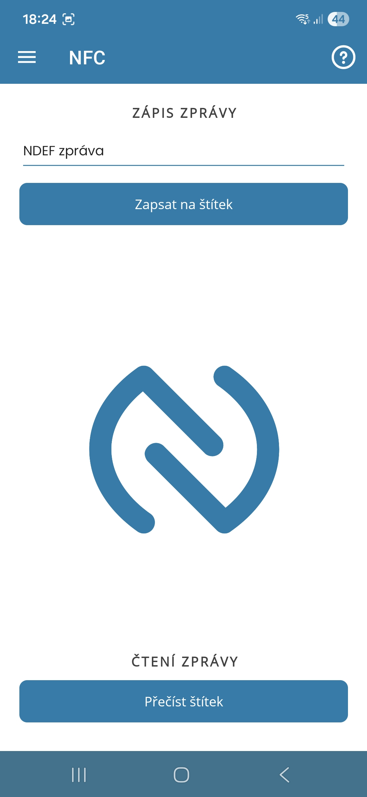 | 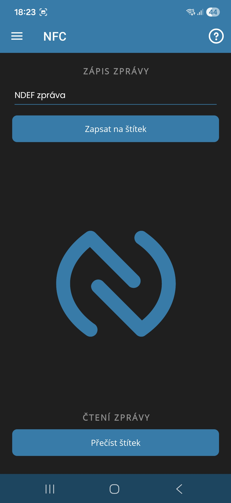 |